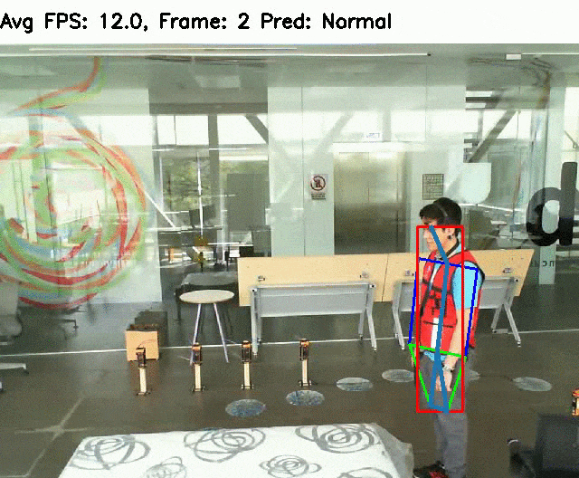

# HumanFallDetection
We augment human pose estimation
(openpifpaf library) by support for multi-camera and multi-person tracking and a long short-term memory (LSTM)
neural network to predict two classes: “Fall” or “No Fall”. From the poses, we extract five temporal and spatial
features which are processed by an LSTM classifier.
<p align="center">

</p>

## Setup

```shell script
pip install -r requirements.txt
```

## Usage
```shell script
python3 fall_detector.py
```
<TABLE>
<TR><TH style="width:120px">Argument</TH><TH style="width:300px">Description</TH><TH>Default</TH></TR>
<TR><TD>num_cams</TD> <TD>Number of Cameras/Videos to process</TD><TD>1</TD></TR>
<TR><TD>video</TD><TD>Path to the video file (None to capture live video from camera(s)) <br>For single video fall
                        detection(--num_cams=1), save your videos as abc.xyz
                        and set --video=abc.xyz<br> For 2 video fall
                        detection(--num_cams=2), save your videos as abc1.xyz
                        & abc2.xyz & set --video=abc.xyz</TD><TD>None</TD></TR>
<TR><TD>save_output</TD> <TD>Save the result in a video file. Output videos are
                        saved in the same directory as input videos with "out"
                        appended at the start of the title</TD><TD>False</TD></TR>
<TR><TD>disable_cuda</TD> <TD>To process frames on CPU by disabling CUDA support on GPU</TD><TD>False</TD></TR>
</TABLE>

## Dataset
We used the [UP-Fall Detection](https://sites.google.com/up.edu.mx/har-up/) to train the LSTM model. You can use [this](https://colab.research.google.com/drive/1PbzVZnwBzFK_CcMf5G3dFrjwKZgfK3Vy?usp=sharing) Colab notebook to download the download the dataset and compile the files into videos.


## Citation
Please cite the following paper in your publications if our work has helped your research: <br> [Multi-camera, multi-person, and real-time fall detection using long short term memory](https://doi.org/10.1117/12.2580700)

                  
    @inproceedings{Taufeeque2021MulticameraMA,
                    author = {Mohammad Taufeeque and Samad Koita and Nicolai Spicher and Thomas M. Deserno},
                    title = {{Multi-camera, multi-person, and real-time fall detection using long short term memory}},
                    volume = {11601},
                    booktitle = {Medical Imaging 2021: Imaging Informatics for Healthcare, Research, and Applications},
                    organization = {International Society for Optics and Photonics},
                    publisher = {SPIE},
                    pages = {35 -- 42},
                    year = {2021},
                    doi = {10.1117/12.2580700},
                    URL = {https://doi.org/10.1117/12.2580700}
                  }
